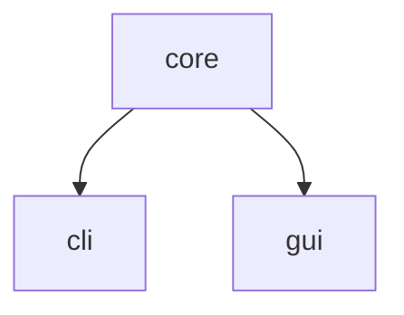

# Kindle notes parser

Take your kindle notes in txt format and output a file per
book.

Ideal for second brains or walled gardens.

## Usage

### CLI

```bash
cargo run -p kindle-notes-cli <filename>
```

### GUI

```bash
cargo run -p kindle-notes-gui
```


## Design

We are using cargo workspaces. There are 3 workspaces:

- `kindle-notes-core`: contains the main business logic
- `kindle-notes-cli`: contains the cli for the terminal app
- `kindle-notes-gui`: contains the gui for the desktop environment




## Resources

- [cli project at rust book](https://doc.rust-lang.org/book/ch12-00-an-io-project.html)
- Droid GUI usage example: [druid-7guis-flight](https://github.com/MrGibus/Druid-7guis/blob/main/src/flights.rs)
