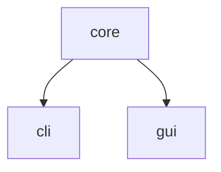

# Kindle notes parser

Take your kindle notes in txt format and output a file per book.

Ideal for second brains or walled gardens.

## Why this?

I usually take notes in my kindle but I don't end up doing anything with them.

As I'm learning rust I wanted to practice on a simple need (language and a bit of UI).

My workflow is like this now:

1. Read a book and add highlights
1. **Cut** the notes from the kindle and paste them in the Downloads folder
1. Use this software to split the books and remove empty or repeated lines.
1. Copy to my [obsidian](https://obsidian.md/) folder
1. Clean and create [flashcards](https://github.com/st3v3nmw/obsidian-spaced-repetition/wiki/Decks)

## Usage

### CLI

```bash
cargo run -p kindle-notes-cli <filename>
```

### GUI

```bash
cargo run -p kindle-notes-gui
```

## Design

We are using cargo workspaces. There are 3 workspaces:

- `kindle-notes-core`: contains the main logic
- `kindle-notes-cli`: contains the cli for the terminal app
- `kindle-notes-gui`: contains the gui for the desktop environment



## Resources

- [cli project at rust book](https://doc.rust-lang.org/book/ch12-00-an-io-project.html)
- Droid GUI usage example: [druid-7guis-flight](https://github.com/MrGibus/Druid-7guis/blob/main/src/flights.rs)
- Open / save example: [druid/examples/open_save](https://github.com/linebender/druid/blob/master/druid/examples/open_save.rs)
